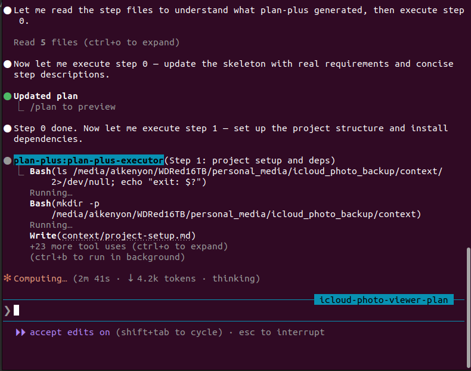
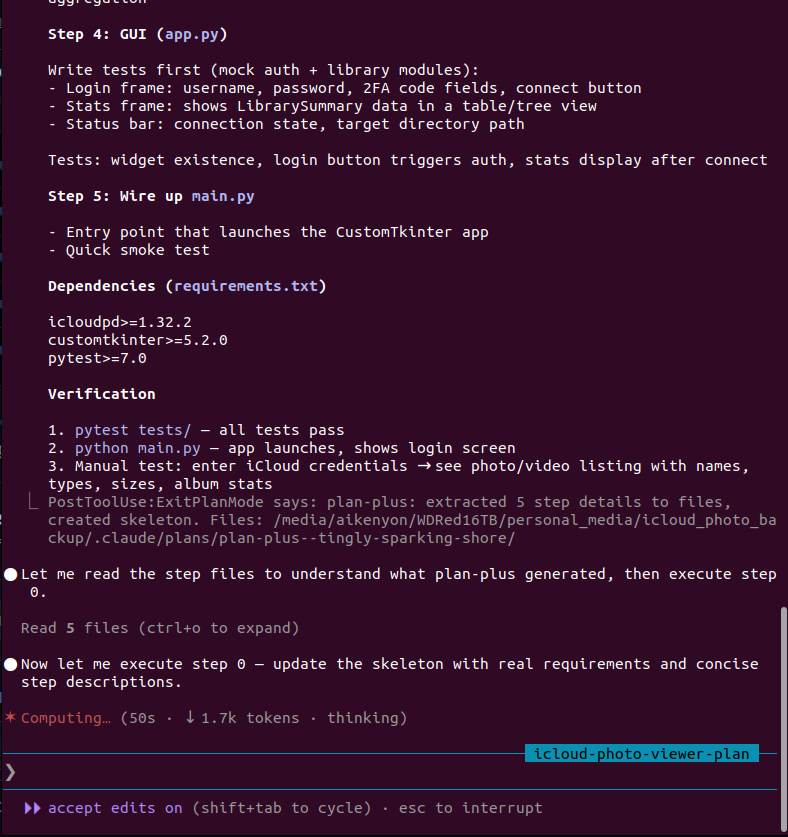

# plan-plus

**Smarter plan execution for Claude Code.**

- Automatically extracts plan steps into individual files when plan mode completes
- Stores project context, goals, and requirements in dedicated context files
- Agents read only the step and context files they need, then their context is discarded
- The main conversation only carries a lightweight skeleton — not the full verbose plan
- Base plan mode re-injects the entire plan every turn, filling context fast — plan-plus fixes this

---

## Quickstart

```bash
claude plugin marketplace add RandyHaylor/plan-plus
claude plugin install plan-plus
```

Restart Claude Code. Use plan mode normally. When you exit plan mode, plan-plus takes over automatically.

---

## Case Study: Pac-Man Calculator

A React calculator app with an animated Pac-Man that navigates the lanes between buttons, turning toward the mouse at intersections — no diagonal movement, no 180° turns, dot-product direction picking at each node.

https://github.com/user-attachments/assets/pacman-calculator-example.mp4

Two sessions built the same app from the same plan and the same 8 context files (lane graph construction, movement algorithm, canvas rendering, calculator reducer, CSS layout, component hierarchy, TypeScript interfaces, edge cases). Both produced near-identical results — Pac-Man successfully navigating between buttons, chomping, turning toward the cursor.

| Metric | plan-plus | Standard plan mode |
|--------|-----------|-------------------|
| Total tokens | **1.59M** | 4.35M |
| API calls | **50** | 98 |
| Peak context | **41K** | 61K |
| Calls at 30K+ context | **23** | 73 |

**63% fewer tokens, 49% fewer API calls.** Plan-plus delegated work to 4 focused agents while standard mode ran all 98 calls in one growing context. The plan-plus output was also more robust — reusable utilities, generic spanning-button detection, correct animation overshoot math — while standard mode had a subtle momentum bug and hardcoded layout assumptions.

---

## The Problem

Claude Code re-injects the full plan file into the in-memory message array on every turn during plan execution. These injections accumulate and can't be removed until compaction. A 4KB plan injected across 30 turns adds ~120KB of duplicate plan content to the main conversation context.

## The Solution

Plan-plus intercepts ExitPlanMode and restructures the plan:

- **Splits** the full plan into individual step files
- **Creates** a lightweight skeleton that replaces the original plan file
- **Mines** the conversation for goals
- **Injects** a Step 0 that uses an agent to fill in real requirements and refine the skeleton
- **Provides** a focused executor agent for step-by-step work with ephemeral context

The skeleton is all that gets injected per turn. Agents read the detailed step files only when they need them, and their context is discarded when they return.

---

## What Happens When You Exit Plan Mode

**Before plan-plus** — the full verbose plan is injected every turn.

**After plan-plus** — your project gets this structure:

```
.claude/plans/plan-plus--<session-name>/
    plan-full.md              Full original plan (backup)
    context/
        project.md            Project context extracted from plan preamble
        goals.md              Goals mined from early conversation messages
        requirements.md       Created by Step 0 agent
    steps/
        00-update-skeleton.md Step 0: agent refines the skeleton
        01-documentation.md   Step detail files with full content
        02-project-setup.md   from each section of the original plan
        03-game-logic.md
        ...
```

**The skeleton** (what gets injected per turn):

```markdown
# plan-plus--vue-checkers-multiplayer

## Instructions
- Use plan-plus-executor agent for each step
- Agent context is ephemeral
- Update context/ files with discoveries
- Mark steps done as you complete them

full plan: .claude/plans/plan-plus--vue-checkers-multiplayer/plan-full.md
context:   .claude/plans/plan-plus--vue-checkers-multiplayer/context/
steps:     .claude/plans/plan-plus--vue-checkers-multiplayer/steps/

## Requirements
- Stack: Vue 3 + Vite + TypeScript + Vitest + Firebase/Firestore
- Architecture: Pure game logic -> Firebase service -> Vue components
- Patterns: Strict TDD, pure functions, reactive composable
- Key features: Multiplayer via Firestore, mandatory jumps, king promotion

## Steps
0. [x] Update skeleton — filled in requirements and step descriptions
1. [ ] Documentation — requirements, user stories, firestore model, flowcharts
2. [ ] Project setup — scaffold, install deps, configure vitest, verify
3. [ ] TDD game logic — types, board, moves, jumps, execution, state
...
```

---

## Screenshots





---

## How It Works

**Plan mode works normally.** Claude researches, explores, writes a detailed plan.

**On ExitPlanMode**, a PostToolUse hook fires and runs a Python script that:

1. Backs up the full plan to `plan-full.md`
2. Splits the plan on `## ` headers into individual step files
3. Routes context-like sections (Context, Background, Overview) to `context/project.md`
4. Mines the JSONL for early user messages (goals) and the session topic name
5. Writes a skeleton with instructions, requirements placeholder, and step list
6. Renames the plan file to `plan-plus--<session-name>.md`
7. Injects `additionalContext` telling Claude to start with Step 0

**Step 0** is always injected as the first step. An agent reads all step files and context, then rewrites the skeleton with real requirements (stack, architecture, patterns, constraints) and clear one-sentence descriptions per step.

**Steps 1-N** are executed by spawning the `plan-plus-executor` agent with just the relevant step file and context files. The agent's context is ephemeral — it won't bloat the main conversation.

---

## Requirements

- Python 3.7+
- Claude Code 2.1.x+

---

## Plugin Contents

```
.claude-plugin/
    marketplace.json             Marketplace manifest

plan-plus/
    .claude-plugin/
        plugin.json              Plugin manifest
    hooks/
        hooks.json               PostToolUse hook on ExitPlanMode
    scripts/
        restructure-plan.py      Restructuring logic (Python)
    agents/
        plan-plus-executor.md    Step execution agent definition
```

---

## Naming

The plan directory and skeleton file are named after the session topic (the name you see above the prompt field in Claude Code). If no topic name is available, falls back to the session ID.

---

## Existing Plan Directory Warning

If plan-plus detects that the plan directory already exists (from a previous ExitPlanMode in the same session), it warns the user and tells the orchestrator to ask whether to keep or remove old files. New step files are appended alongside existing ones.

---

## Technical Background

Claude Code's plan execution mode re-injects the plan file content as a `plan_file_reference` attachment on every turn. These attachments are computed in-memory from the plan file on disk and appended to the persistent message array via React state (`setMessages`). They accumulate there until compaction replaces the entire message array — meaning every turn of execution adds another copy of the full plan into the main conversation's in-memory context.

By replacing the plan file with a small skeleton, each injection is a fraction of the size. The verbose plan content lives in step files that only agents read in their ephemeral context, keeping the main conversation lean throughout execution.

---

## License

MIT

---

## What It Actually Does (User Story)

**You:** Open a fresh Claude Code session, switch on plan mode, and type: "build me a Vue 3 multiplayer checkers game with Firebase."

**Claude:** Spends several turns researching your codebase, thinking through the architecture, and writes a detailed plan — stack choices, file structure, game logic, TDD approach, deployment. You read it, it looks good. You approve.

**The moment you hit approve**, before Claude writes a single line of code, the plan-plus hook fires. In the background, Python reads the plan file Claude just wrote, splits every `##` section into its own file, saves the full plan as a backup, mines your early messages for goals, and rewrites the plan file in place with a lightweight skeleton — a short checklist with paths to the detail files.

**Claude's first move** is to spawn an ephemeral agent (Step 0) that reads every step file and every context file, then comes back and fills in the Requirements section of the skeleton with the real stack, architecture decisions, and constraints. The agent's context is thrown away when it's done.

**For each subsequent step**, Claude spawns another ephemeral agent, hands it just the relevant step file and context files, and lets it do the work. When the agent finishes and returns, its entire working context is gone. The main conversation never saw any of it.

**What you see** in the main conversation: a short skeleton getting checkboxes ticked off, one by one. No re-injected walls of plan text accumulating turn after turn. The context stays clean across the whole build.

**When it's done**, your project is built and the main conversation is still lightweight enough to keep going — ask follow-up questions, request changes, start a new feature — without hitting context limits from the plan you approved at the start.
